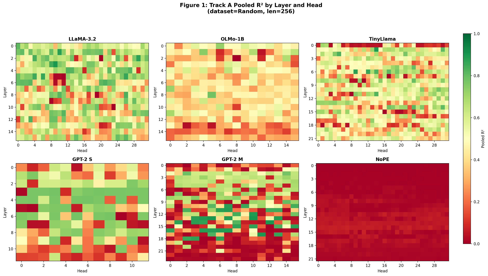
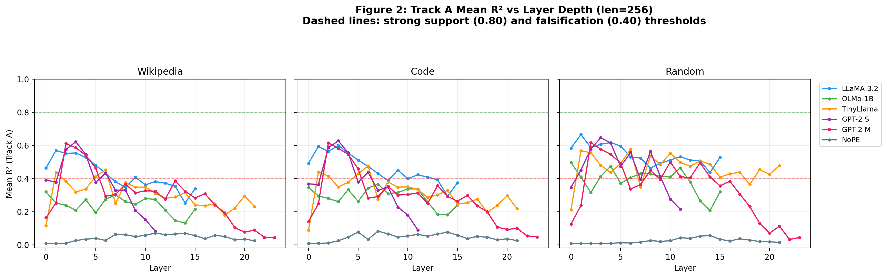
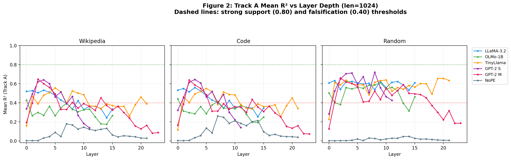
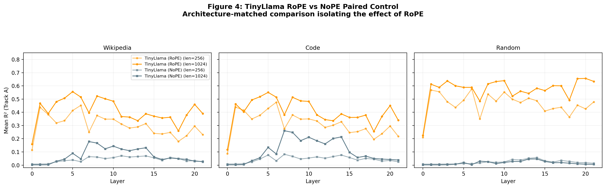
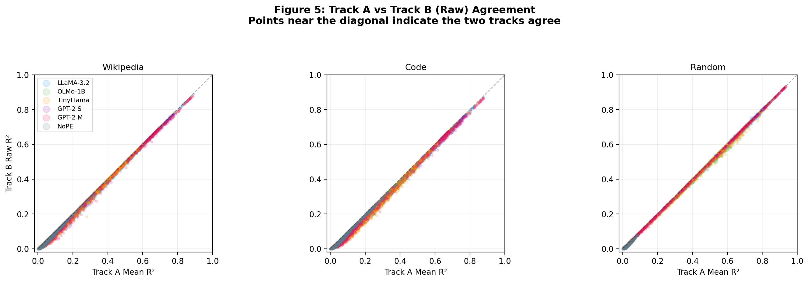
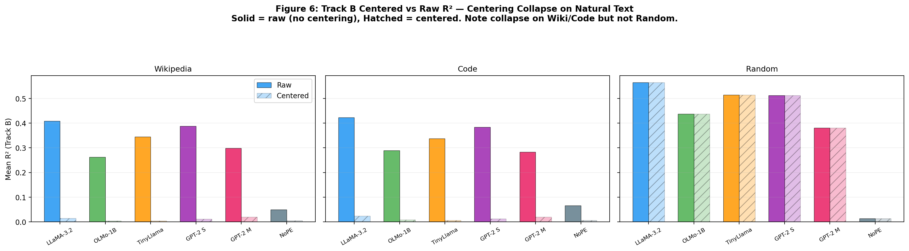
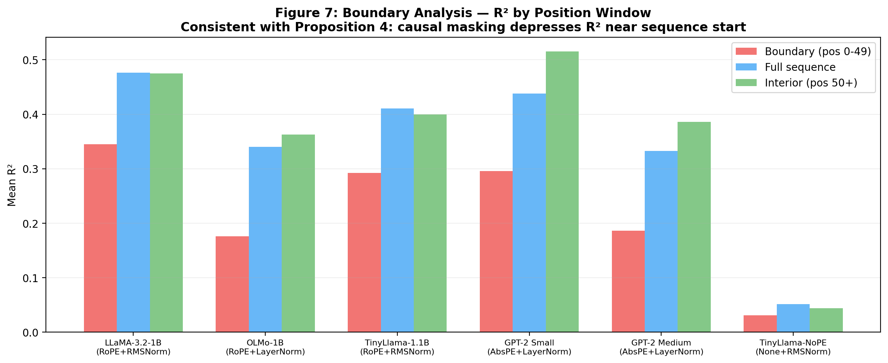
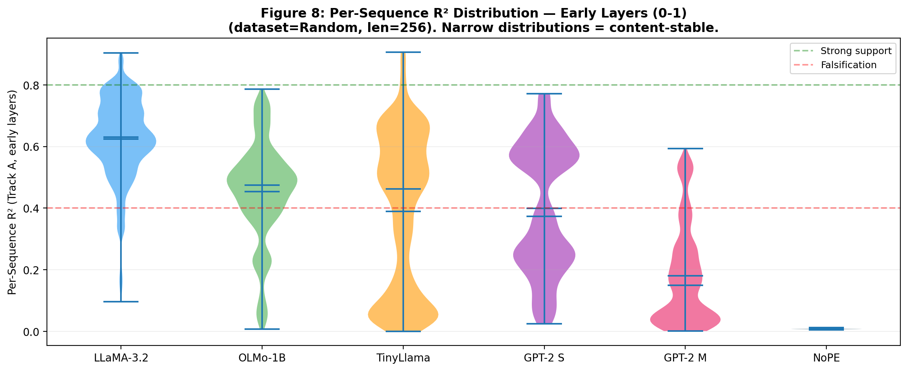
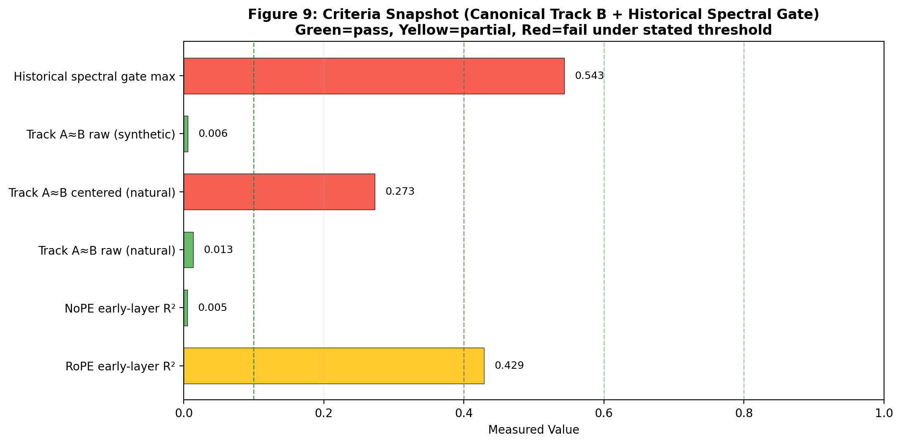

# Experiment 1 Results

## Document Status and Snapshot Scope

This document is a deep-audit Experiment 1 results rewrite aligned to the latest completed runs, including the canonical Track B rerun and an exploratory spectral pass. It supersedes earlier drafts that only covered the legacy Track B namespace and pre-exploratory spectral status.

Snapshot captured: `2026-02-27T01:06:47+00:00`

Current status at this snapshot:

- No Track B reruns are pending.
- Legacy Track B namespace (`results/track_b/**`) is complete.
- Canonical Track B namespace (`results/track_b_canonical_perpos_v1/**`) is complete.
- Historical prereg-gated spectral metadata (`results/spectral/**`) remains as a historical record (all gate-blocked in that namespace).
- Exploratory ungated spectral outputs (`results/spectral_canonical_perpos_v1_t0/**`) are complete for all combos.

Scope split used in this report:

- **Confirmatory/prereg context:** `results/spectral/**` (historical gated behavior at threshold `0.6`).
- **Exploratory context:** `results/spectral_canonical_perpos_v1_t0/**` (ungated exploratory run at threshold `0.0`).

Scope note: this report is based on summary artifacts and metadata (`summary.parquet`, `per_sequence.parquet`, `spectral_run.json`, `spectral.parquet`, and manifest metadata). It does not reinterpret raw `*.pt` tensors.

## Research Hypotheses Tested

Experiment 1 remains grounded in the preregistered framing in `experiment1/experiment1overview.md`: measure whether attention-logit structure is well-approximated by a shift-invariant kernel `g(Δ)` and characterize where that structure holds strongly, partially, or weakly across models/layers/heads/datasets/lengths.

Primary hypothesis (overview Section "Hypothesis and Exploratory Framing"):

- In PE-equipped models (especially RoPE families), early-layer attention structure should show meaningful shift-invariant fit quality, with depth-dependent attenuation as content-position entanglement accumulates.

Secondary (contingent) hypothesis (overview Step 2 spectral section):

- If early-layer shift signal is strong enough, spectral peaks of recovered kernels should align with PE frequencies (especially RoPE), while NoPE controls should not show equivalent structured alignment.

Preregistered interpretation anchors (from `experiment1/experiment1overview.md`) used throughout this document:

- Early-layer pooled R² (`layers 0–1`) for RoPE models: `> 0.80` strong support, `0.40–0.80` partial/intermediate, `< 0.40` falsification region.
- Track A vs Track B early-layer agreement target: `|R²_A − R²_B| < 0.10`.
- Spectral gate condition: mean early-layer Track A R² `> 0.60`.
- NoPE expectation: low early-layer R².

Interpretation rule in this rewrite:

- Exploratory spectral outputs are treated as **informative but non-confirmatory** relative to prereg gate logic.

## Experimental Design and Runs Executed

The experiment grid is unchanged from `experiment1/experiment1overview.md` and `experiment1/config.py`:

- Models: `gpt2-small`, `gpt2-medium`, `olmo-1b`, `llama-3.2-1b`, `tinyllama-1.1b`, `tinyllama-nope-1.1b`
- Datasets: `wiki40b_en_pre2019`, `codesearchnet_python_snapshot`, `synthetic_random`
- Sequence lengths: `256`, `1024`
- Total combos per stage: `6 × 3 × 2 = 36`

Split policy (as specified in `experiment1/experiment1overview.md`):

- Natural/code datasets use deterministic centering/eval split (`0–99` centering, `100–199` eval).
- Synthetic dataset skips centering and uses all 200 eval sequences.

Executed stage namespaces and intended role:

- `results/track_a/**`: primary raw-logit measurement.
- `results/track_b/**`: legacy Track B baseline (per-position centered variant + raw variant).
- `results/track_b_canonical_perpos_v1/**`: canonical-frame per-position diagnostic rerun.
- `results/boundary/**`: boundary/interior/full window analysis.
- `results/spectral/**`: historical prereg-style gated spectral metadata.
- `results/spectral_canonical_perpos_v1_t0/**`: exploratory ungated spectral pass over canonical Track B outputs.

This structure is directly tied to the overview’s Track A / Track B / boundary / spectral design, with the canonical Track B and exploratory spectral namespaces added as post-preregistered methodological diagnostics.

## Artifact Coverage and Run Completion Status

### Coverage Summary

| track | expected_combos | present_summary | present_per_sequence | notes |
| --- | --- | --- | --- | --- |
| track_a | 36 | 36 | 36 | Baseline Track A |
| track_b | 36 | 36 | 0 | Legacy Track B baseline |
| boundary | 36 | 36 | 36 | Boundary baseline |
| spectral | 36 | 36 | 0 | Historical prereg-gated spectral metadata |
| track_b_canonical_perpos_v1 | 36 | 36 | 0 | Canonical per-position diagnostic rerun |
| spectral_canonical_perpos_v1_t0 | 36 | 36 | 36 | Exploratory ungated spectral pass over canonical Track B |

Coverage interpretation:

- Baseline Experiment 1 tracks are complete (`track_a`, `track_b`, `boundary`, `spectral` metadata).
- Post-preregistered diagnostic namespaces are also complete (`track_b_canonical_perpos_v1`, `spectral_canonical_perpos_v1_t0`).
- Historical `results/spectral/**` having `0` `spectral.parquet` files is namespace-specific (gate-blocked historical run), not a global statement about current spectral availability.

### Run Manifest Metadata

| file | timestamp | git_sha | entries |
| --- | --- | --- | --- |
| results/manifests/run_20260222T0200Z.json | 2026-02-22T07:40:11.428733Z |  | 14 |

Manifest note: this report incorporates post-manifest rerun namespaces (`track_b_canonical_perpos_v1`, `spectral_canonical_perpos_v1_t0`) in addition to the baseline manifest snapshot.

### Canonical Track B Rerun Completion Note

The canonical per-position Track B diagnostic rerun is complete at `36/36` combos in `results/track_b_canonical_perpos_v1/**`. No pending Track B rows remain for this document snapshot.

## Results — Track A (Raw Logit Measurement)

Track A is the primary measurement in the Experiment 1 design. It fits a shift-invariant kernel directly to raw pre-softmax attention logits on evaluation sequences and stores both per-sequence variability summaries (`mean_r2`, `std_r2`) and pooled fits (`pooled_r2`) at the head level. Because all Track A outputs are present and no Track A reruns are pending in this snapshot, this section is fully populated.

**Key figures for this section:** Figure 1 (R² heatmaps by layer and head), Figure 2 (R² vs layer depth), Figure 3 (model comparison bar chart), Figure 4 (TinyLlama vs NoPE paired control), Figure 8 (per-sequence R² distributions).

### Track A Per-Combo Summary (Early-Layer Mean vs Overall Mean)

| model | dataset | len | early_mean_r2 | overall_mean_r2 | mean_pooled_r2 | rows | layers | heads | eval_sequences |
| --- | --- | --- | --- | --- | --- | --- | --- | --- | --- |
| gpt2-medium | codesearchnet_python_snapshot | 256 | 0.1942 | 0.2805 | 0.2830 | 384 | 24 | 16 | 100 |
| gpt2-medium | codesearchnet_python_snapshot | 1024 | 0.2753 | 0.3238 | 0.3252 | 384 | 24 | 16 | 100 |
| gpt2-medium | synthetic_random | 256 | 0.1805 | 0.3346 | 0.3348 | 384 | 24 | 16 | 200 |
| gpt2-medium | synthetic_random | 1024 | 0.2690 | 0.4348 | 0.4353 | 384 | 24 | 16 | 200 |
| gpt2-medium | wiki40b_en_pre2019 | 256 | 0.2084 | 0.2880 | 0.2893 | 384 | 24 | 16 | 100 |
| gpt2-medium | wiki40b_en_pre2019 | 1024 | 0.2942 | 0.3347 | 0.3354 | 384 | 24 | 16 | 100 |
| gpt2-small | codesearchnet_python_snapshot | 256 | 0.3662 | 0.3745 | 0.3750 | 144 | 12 | 12 | 100 |
| gpt2-small | codesearchnet_python_snapshot | 1024 | 0.3865 | 0.4306 | 0.4316 | 144 | 12 | 12 | 100 |
| gpt2-small | synthetic_random | 256 | 0.3987 | 0.4609 | 0.4610 | 144 | 12 | 12 | 200 |
| gpt2-small | synthetic_random | 1024 | 0.4025 | 0.5678 | 0.5682 | 144 | 12 | 12 | 200 |
| gpt2-small | wiki40b_en_pre2019 | 256 | 0.3847 | 0.3686 | 0.3688 | 144 | 12 | 12 | 100 |
| gpt2-small | wiki40b_en_pre2019 | 1024 | 0.4141 | 0.4255 | 0.4256 | 144 | 12 | 12 | 100 |
| llama-3.2-1b | codesearchnet_python_snapshot | 256 | 0.5433 | 0.4593 | 0.4675 | 512 | 16 | 32 | 100 |
| llama-3.2-1b | codesearchnet_python_snapshot | 1024 | 0.5411 | 0.4226 | 0.4246 | 512 | 16 | 32 | 100 |
| llama-3.2-1b | synthetic_random | 256 | 0.6247 | 0.5435 | 0.5441 | 512 | 16 | 32 | 200 |
| llama-3.2-1b | synthetic_random | 1024 | 0.6212 | 0.5956 | 0.5966 | 512 | 16 | 32 | 200 |
| llama-3.2-1b | wiki40b_en_pre2019 | 256 | 0.5172 | 0.4235 | 0.4245 | 512 | 16 | 32 | 100 |
| llama-3.2-1b | wiki40b_en_pre2019 | 1024 | 0.5230 | 0.4138 | 0.4142 | 512 | 16 | 32 | 100 |
| olmo-1b | codesearchnet_python_snapshot | 256 | 0.3202 | 0.2906 | 0.2944 | 256 | 16 | 16 | 100 |
| olmo-1b | codesearchnet_python_snapshot | 1024 | 0.3775 | 0.3177 | 0.3183 | 256 | 16 | 16 | 100 |
| olmo-1b | synthetic_random | 256 | 0.4532 | 0.3878 | 0.3882 | 256 | 16 | 16 | 200 |
| olmo-1b | synthetic_random | 1024 | 0.4514 | 0.5056 | 0.5068 | 256 | 16 | 16 | 200 |
| olmo-1b | wiki40b_en_pre2019 | 256 | 0.2856 | 0.2390 | 0.2395 | 256 | 16 | 16 | 100 |
| olmo-1b | wiki40b_en_pre2019 | 1024 | 0.3455 | 0.2999 | 0.3001 | 256 | 16 | 16 | 100 |
| tinyllama-1.1b | codesearchnet_python_snapshot | 256 | 0.2630 | 0.3136 | 0.3136 | 704 | 22 | 32 | 100 |
| tinyllama-1.1b | codesearchnet_python_snapshot | 1024 | 0.2899 | 0.4040 | 0.4049 | 704 | 22 | 32 | 100 |
| tinyllama-1.1b | synthetic_random | 256 | 0.3895 | 0.4640 | 0.4646 | 704 | 22 | 32 | 200 |
| tinyllama-1.1b | synthetic_random | 1024 | 0.4189 | 0.5738 | 0.5755 | 704 | 22 | 32 | 200 |
| tinyllama-1.1b | wiki40b_en_pre2019 | 256 | 0.2758 | 0.3011 | 0.3018 | 704 | 22 | 32 | 100 |
| tinyllama-1.1b | wiki40b_en_pre2019 | 1024 | 0.3134 | 0.4098 | 0.4105 | 704 | 22 | 32 | 100 |
| tinyllama-nope-1.1b | codesearchnet_python_snapshot | 256 | 0.0088 | 0.0452 | 0.0459 | 704 | 22 | 32 | 100 |
| tinyllama-nope-1.1b | codesearchnet_python_snapshot | 1024 | 0.0024 | 0.1083 | 0.1117 | 704 | 22 | 32 | 100 |
| tinyllama-nope-1.1b | synthetic_random | 256 | 0.0077 | 0.0232 | 0.0240 | 704 | 22 | 32 | 200 |
| tinyllama-nope-1.1b | synthetic_random | 1024 | 0.0019 | 0.0171 | 0.0177 | 704 | 22 | 32 | 200 |
| tinyllama-nope-1.1b | wiki40b_en_pre2019 | 256 | 0.0083 | 0.0426 | 0.0432 | 704 | 22 | 32 | 100 |
| tinyllama-nope-1.1b | wiki40b_en_pre2019 | 1024 | 0.0021 | 0.0738 | 0.0754 | 704 | 22 | 32 | 100 |

The per-combo table above is the core descriptive surface for Track A at the `(model, dataset, len)` level. `early_mean_r2` is the mean over layers 0–1 heads (the preregistered early-layer focus), while `overall_mean_r2` averages over all heads/layers in each combo. `mean_pooled_r2` is included because the preregistered thresholds and spectral gate concept refer to pooled Track A behavior. See Figure 1 for the full per-head spatial distribution and Figure 2 for the layer depth profiles.

### Track A Model-Level Averages (All 6 Combos per Model)

| model | combos | early_mean_r2 | overall_mean_r2 | mean_pooled_r2 |
| --- | --- | --- | --- | --- |
| llama-3.2-1b | 6 | 0.5617 | 0.4764 | 0.4786 |
| gpt2-small | 6 | 0.3921 | 0.4380 | 0.4384 |
| olmo-1b | 6 | 0.3722 | 0.3401 | 0.3412 |
| tinyllama-1.1b | 6 | 0.3251 | 0.4110 | 0.4118 |
| gpt2-medium | 6 | 0.2369 | 0.3327 | 0.3338 |
| tinyllama-nope-1.1b | 6 | 0.0052 | 0.0517 | 0.0530 |

This table compresses the full 36-combo grid by model family. It is useful for comparing architectural families before drilling into dataset- and length-specific rows. See Figure 3 for a visual comparison of early-layer vs all-layer R² across models.

### Track A Dataset-Level Averages (All Models and Lengths)

| dataset | combos | early_mean_r2 | overall_mean_r2 | mean_pooled_r2 |
| --- | --- | --- | --- | --- |
| synthetic_random | 12 | 0.3516 | 0.4091 | 0.4097 |
| wiki40b_en_pre2019 | 12 | 0.2977 | 0.3017 | 0.3024 |
| codesearchnet_python_snapshot | 12 | 0.2974 | 0.3142 | 0.3163 |

The dataset-level table provides a coarse view of data sensitivity. Because it averages across heterogeneous model families, it is descriptive only and should be interpreted alongside the model-level and paired-control tables.

### Track A Length Sensitivity (Early-Layer Mean R², 1024 − 256)

| model | dataset | r2_len_256 | r2_len_1024 | delta_1024_minus_256 |
| --- | --- | --- | --- | --- |
| gpt2-medium | codesearchnet_python_snapshot | 0.1942 | 0.2753 | 0.0811 |
| gpt2-medium | synthetic_random | 0.1805 | 0.2690 | 0.0885 |
| gpt2-medium | wiki40b_en_pre2019 | 0.2084 | 0.2942 | 0.0858 |
| gpt2-small | codesearchnet_python_snapshot | 0.3662 | 0.3865 | 0.0203 |
| gpt2-small | synthetic_random | 0.3987 | 0.4025 | 0.0038 |
| gpt2-small | wiki40b_en_pre2019 | 0.3847 | 0.4141 | 0.0294 |
| llama-3.2-1b | codesearchnet_python_snapshot | 0.5433 | 0.5411 | -0.0023 |
| llama-3.2-1b | synthetic_random | 0.6247 | 0.6212 | -0.0035 |
| llama-3.2-1b | wiki40b_en_pre2019 | 0.5172 | 0.5230 | 0.0058 |
| olmo-1b | codesearchnet_python_snapshot | 0.3202 | 0.3775 | 0.0573 |
| olmo-1b | synthetic_random | 0.4532 | 0.4514 | -0.0018 |
| olmo-1b | wiki40b_en_pre2019 | 0.2856 | 0.3455 | 0.0599 |
| tinyllama-1.1b | codesearchnet_python_snapshot | 0.2630 | 0.2899 | 0.0269 |
| tinyllama-1.1b | synthetic_random | 0.3895 | 0.4189 | 0.0293 |
| tinyllama-1.1b | wiki40b_en_pre2019 | 0.2758 | 0.3134 | 0.0376 |
| tinyllama-nope-1.1b | codesearchnet_python_snapshot | 0.0088 | 0.0024 | -0.0064 |
| tinyllama-nope-1.1b | synthetic_random | 0.0077 | 0.0019 | -0.0058 |
| tinyllama-nope-1.1b | wiki40b_en_pre2019 | 0.0083 | 0.0021 | -0.0062 |

This length-delta table is especially useful for spotting model-specific context-length effects that would be hidden in overall averages.

### TinyLlama vs TinyLlama-NoPE Paired Control (Track A)

| dataset | len | tinyllama_early_mean_r2 | tinyllama_nope_early_mean_r2 | early_gap | tinyllama_overall_mean_r2 | tinyllama_nope_overall_mean_r2 | overall_gap |
| --- | --- | --- | --- | --- | --- | --- | --- |
| codesearchnet_python_snapshot | 256 | 0.2630 | 0.0088 | 0.2542 | 0.3136 | 0.0452 | 0.2684 |
| codesearchnet_python_snapshot | 1024 | 0.2899 | 0.0024 | 0.2875 | 0.4040 | 0.1083 | 0.2956 |
| synthetic_random | 256 | 0.3895 | 0.0077 | 0.3818 | 0.4640 | 0.0232 | 0.4407 |
| synthetic_random | 1024 | 0.4189 | 0.0019 | 0.4169 | 0.5738 | 0.0171 | 0.5566 |
| wiki40b_en_pre2019 | 256 | 0.2758 | 0.0083 | 0.2675 | 0.3011 | 0.0426 | 0.2585 |
| wiki40b_en_pre2019 | 1024 | 0.3134 | 0.0021 | 0.3114 | 0.4098 | 0.0738 | 0.3360 |

### Track A Descriptive Findings (Snapshot)

The highest early-layer Track A values in this snapshot are dominated by `llama-3.2-1b`, especially on `synthetic_random`, with the top observed combo (`llama-3.2-1b / synthetic_random / len_256`) reaching early-layer mean R² `0.6247` and overall mean R² `0.5435`. The same model remains strong at `len_1024` on synthetic (`0.6212` early; `0.5956` overall), indicating that the early-layer signal is not collapsing at the longer context for this model.

The paired TinyLlama NoPE control is the clearest low-signal region in Track A. For example, `tinyllama-nope-1.1b / wiki40b_en_pre2019 / len_256` reports early-layer mean R² `0.0083` and overall mean R² `0.0426`, and `tinyllama-nope-1.1b / synthetic_random / len_1024` is even lower at early-layer mean R² `0.0019`. The paired-control table above shows large gaps between TinyLlama and TinyLlama-NoPE for every dataset/length condition listed.

The Track A top and bottom tails (by early-layer mean R²) provide a compact qualitative summary of the current landscape:

**Top observed early-layer Track A combos (by early-layer mean R²):**
- `llama-3.2-1b / synthetic_random / len_256`: early-layer mean R² = `0.6247`, overall mean R² = `0.5435`, pooled = `0.5441` (rows=`512`, eval seqs=`200`).
- `llama-3.2-1b / synthetic_random / len_1024`: early-layer mean R² = `0.6212`, overall mean R² = `0.5956`, pooled = `0.5966` (rows=`512`, eval seqs=`200`).
- `llama-3.2-1b / codesearchnet_python_snapshot / len_256`: early-layer mean R² = `0.5433`, overall mean R² = `0.4593`, pooled = `0.4675` (rows=`512`, eval seqs=`100`).
- `llama-3.2-1b / codesearchnet_python_snapshot / len_1024`: early-layer mean R² = `0.5411`, overall mean R² = `0.4226`, pooled = `0.4246` (rows=`512`, eval seqs=`100`).
- `llama-3.2-1b / wiki40b_en_pre2019 / len_1024`: early-layer mean R² = `0.5230`, overall mean R² = `0.4138`, pooled = `0.4142` (rows=`512`, eval seqs=`100`).
- `llama-3.2-1b / wiki40b_en_pre2019 / len_256`: early-layer mean R² = `0.5172`, overall mean R² = `0.4235`, pooled = `0.4245` (rows=`512`, eval seqs=`100`).

**Bottom observed early-layer Track A combos (by early-layer mean R²):**
- `tinyllama-nope-1.1b / synthetic_random / len_1024`: early-layer mean R² = `0.0019`, overall mean R² = `0.0171`, pooled = `0.0177` (rows=`704`, eval seqs=`200`).
- `tinyllama-nope-1.1b / wiki40b_en_pre2019 / len_1024`: early-layer mean R² = `0.0021`, overall mean R² = `0.0738`, pooled = `0.0754` (rows=`704`, eval seqs=`100`).
- `tinyllama-nope-1.1b / codesearchnet_python_snapshot / len_1024`: early-layer mean R² = `0.0024`, overall mean R² = `0.1083`, pooled = `0.1117` (rows=`704`, eval seqs=`100`).
- `tinyllama-nope-1.1b / synthetic_random / len_256`: early-layer mean R² = `0.0077`, overall mean R² = `0.0232`, pooled = `0.0240` (rows=`704`, eval seqs=`200`).
- `tinyllama-nope-1.1b / wiki40b_en_pre2019 / len_256`: early-layer mean R² = `0.0083`, overall mean R² = `0.0426`, pooled = `0.0432` (rows=`704`, eval seqs=`100`).
- `tinyllama-nope-1.1b / codesearchnet_python_snapshot / len_256`: early-layer mean R² = `0.0088`, overall mean R² = `0.0452`, pooled = `0.0459` (rows=`704`, eval seqs=`100`).

Several additional descriptive patterns are visible directly in the Track A tables:

- The model-level table shows `llama-3.2-1b` as the strongest average early-layer Track A performer in this snapshot, with GPT-2 small and OLMo-1B occupying the next tier and TinyLlama-NoPE far below the rest.
- The dataset-level table shows `synthetic_random` with the highest average Track A values across the full model set, which is notable because the synthetic control is not universally lower than natural-text conditions in this run.
- The length-sensitivity table shows model-dependent behavior rather than a single shared trend: several models improve at `1024` on early-layer means, while some rows are nearly flat and a few degrade slightly.
- The TinyLlama paired table shows that the RoPE-vs-NoPE gap widens further on some `len_1024` conditions in both early and overall Track A means.

### Representative Track A Files (Exact Examples)

Representative high-signal example (Track A): `results/track_a/llama-3.2-1b/synthetic_random/len_256/summary.parquet` with early-layer mean R² `0.624702` and overall mean R² `0.543529`.

Representative paired-control low-signal example (Track A): `results/track_a/tinyllama-nope-1.1b/wiki40b_en_pre2019/len_256/summary.parquet` with early-layer mean R² `0.008268` and overall mean R² `0.042589`.

## Results — Track B (Averaged Gram Matrix)

Track B now has two complete result namespaces for direct comparison:

- **Legacy baseline:** `results/track_b/**`
- **Canonical diagnostic rerun:** `results/track_b_canonical_perpos_v1/**`

Both include `r2_centered` and `r2_raw`, plus Track A comparison columns (`track_a_mean_r2`, `track_a_diff`).

### Variant Definitions and Intended Role

- **Legacy per-position centered Track B (`track_b`)**
  - Centering means are estimated and subtracted per `(layer, head, position)` in the captured frame.
  - This is the original Experiment 1 Track B path.

- **Canonical per-position centered Track B (`track_b_canonical_perpos_v1`)**
  - For RoPE models, centering is performed in canonical frame but still per-position.
  - By design, this is a diagnostic equivalence check, not a final methodological fix.

This maps directly to the post-run caveat in Step B1 of `experiment1/experiment1overview.md`: per-position centering can attenuate natural-text centered signal, so centered Track B remains methodology-sensitive.

### Full Legacy vs Canonical Quantitative Comparison (Per Combo)

| model | dataset | len | mean_centered_legacy | mean_raw_legacy | mean_centered_canon | mean_raw_canon | delta_centered_canon_minus_legacy | delta_raw_canon_minus_legacy | mean_track_a | canon_raw_minus_track_a | rows | layers | heads |
| --- | --- | --- | --- | --- | --- | --- | --- | --- | --- | --- | --- | --- | --- |
| gpt2-small | wiki40b_en_pre2019 | 256 | 0.018057 | 0.356705 | 0.018057 | 0.356705 | 0.000000 | 0.000000 | 0.368636 | -0.011930 | 144 | 12 | 12 |
| gpt2-small | wiki40b_en_pre2019 | 1024 | 0.006014 | 0.419999 | 0.006014 | 0.419999 | -0.000000 | -0.000000 | 0.425540 | -0.005541 | 144 | 12 | 12 |
| gpt2-small | codesearchnet_python_snapshot | 256 | 0.017568 | 0.351681 | 0.017568 | 0.351681 | -0.000000 | 0.000000 | 0.374540 | -0.022858 | 144 | 12 | 12 |
| gpt2-small | codesearchnet_python_snapshot | 1024 | 0.007138 | 0.415095 | 0.007138 | 0.415095 | -0.000000 | 0.000000 | 0.430622 | -0.015527 | 144 | 12 | 12 |
| gpt2-small | synthetic_random | 256 | 0.456981 | 0.456981 | 0.456981 | 0.456981 | 0.000000 | 0.000000 | 0.460851 | -0.003869 | 144 | 12 | 12 |
| gpt2-small | synthetic_random | 1024 | 0.566376 | 0.566376 | 0.566376 | 0.566376 | 0.000000 | 0.000000 | 0.567796 | -0.001420 | 144 | 12 | 12 |
| gpt2-medium | wiki40b_en_pre2019 | 256 | 0.029373 | 0.271011 | 0.029373 | 0.271011 | 0.000000 | 0.000000 | 0.288028 | -0.017018 | 384 | 24 | 16 |
| gpt2-medium | wiki40b_en_pre2019 | 1024 | 0.011475 | 0.326416 | 0.011475 | 0.326416 | -0.000000 | 0.000000 | 0.334701 | -0.008285 | 384 | 24 | 16 |
| gpt2-medium | codesearchnet_python_snapshot | 256 | 0.028487 | 0.256667 | 0.028487 | 0.256667 | -0.000000 | 0.000000 | 0.280484 | -0.023817 | 384 | 24 | 16 |
| gpt2-medium | codesearchnet_python_snapshot | 1024 | 0.011600 | 0.308760 | 0.011600 | 0.308760 | 0.000000 | 0.000000 | 0.323821 | -0.015061 | 384 | 24 | 16 |
| gpt2-medium | synthetic_random | 256 | 0.329418 | 0.329418 | 0.329418 | 0.329418 | 0.000000 | 0.000000 | 0.334558 | -0.005140 | 384 | 24 | 16 |
| gpt2-medium | synthetic_random | 1024 | 0.432204 | 0.432204 | 0.432204 | 0.432204 | 0.000000 | 0.000000 | 0.434783 | -0.002579 | 384 | 24 | 16 |
| olmo-1b | wiki40b_en_pre2019 | 256 | 0.007357 | 0.230489 | 0.007357 | 0.230489 | -0.000000 | 0.000000 | 0.238969 | -0.008480 | 256 | 16 | 16 |
| olmo-1b | wiki40b_en_pre2019 | 1024 | 0.002471 | 0.294661 | 0.002471 | 0.294661 | 0.000000 | 0.000000 | 0.299855 | -0.005194 | 256 | 16 | 16 |
| olmo-1b | codesearchnet_python_snapshot | 256 | 0.012524 | 0.274887 | 0.012524 | 0.274887 | 0.000000 | 0.000000 | 0.290569 | -0.015682 | 256 | 16 | 16 |
| olmo-1b | codesearchnet_python_snapshot | 1024 | 0.004973 | 0.304455 | 0.004973 | 0.304455 | 0.000000 | 0.000000 | 0.317694 | -0.013239 | 256 | 16 | 16 |
| olmo-1b | synthetic_random | 256 | 0.381393 | 0.381393 | 0.381393 | 0.381393 | 0.000000 | 0.000000 | 0.387770 | -0.006378 | 256 | 16 | 16 |
| olmo-1b | synthetic_random | 1024 | 0.493806 | 0.493806 | 0.493806 | 0.493806 | 0.000000 | 0.000000 | 0.505617 | -0.011811 | 256 | 16 | 16 |
| llama-3.2-1b | wiki40b_en_pre2019 | 256 | 0.021494 | 0.409386 | 0.021494 | 0.409386 | -0.000000 | 0.000000 | 0.423475 | -0.014089 | 512 | 16 | 32 |
| llama-3.2-1b | wiki40b_en_pre2019 | 1024 | 0.008753 | 0.406577 | 0.008753 | 0.406577 | -0.000000 | 0.000000 | 0.413826 | -0.007249 | 512 | 16 | 32 |
| llama-3.2-1b | codesearchnet_python_snapshot | 256 | 0.033128 | 0.437228 | 0.033129 | 0.437228 | 0.000001 | 0.000000 | 0.459272 | -0.022044 | 512 | 16 | 32 |
| llama-3.2-1b | codesearchnet_python_snapshot | 1024 | 0.015397 | 0.408095 | 0.015397 | 0.408095 | -0.000000 | 0.000000 | 0.422595 | -0.014500 | 512 | 16 | 32 |
| llama-3.2-1b | synthetic_random | 256 | 0.537432 | 0.537432 | 0.537432 | 0.537432 | 0.000000 | 0.000000 | 0.543529 | -0.006097 | 512 | 16 | 32 |
| llama-3.2-1b | synthetic_random | 1024 | 0.591659 | 0.591659 | 0.591659 | 0.591659 | 0.000000 | 0.000000 | 0.595594 | -0.003935 | 512 | 16 | 32 |
| tinyllama-1.1b | wiki40b_en_pre2019 | 256 | 0.007174 | 0.286619 | 0.007174 | 0.286619 | -0.000000 | 0.000000 | 0.301101 | -0.014482 | 704 | 22 | 32 |
| tinyllama-1.1b | wiki40b_en_pre2019 | 1024 | 0.002051 | 0.403482 | 0.002051 | 0.403482 | -0.000000 | 0.000000 | 0.409798 | -0.006317 | 704 | 22 | 32 |
| tinyllama-1.1b | codesearchnet_python_snapshot | 256 | 0.008921 | 0.284988 | 0.008921 | 0.284988 | -0.000000 | 0.000000 | 0.313604 | -0.028616 | 704 | 22 | 32 |
| tinyllama-1.1b | codesearchnet_python_snapshot | 1024 | 0.004955 | 0.390313 | 0.004955 | 0.390313 | -0.000000 | 0.000000 | 0.403952 | -0.013639 | 704 | 22 | 32 |
| tinyllama-1.1b | synthetic_random | 256 | 0.459092 | 0.459092 | 0.459092 | 0.459092 | 0.000000 | 0.000000 | 0.463982 | -0.004890 | 704 | 22 | 32 |
| tinyllama-1.1b | synthetic_random | 1024 | 0.568893 | 0.568893 | 0.568893 | 0.568893 | 0.000000 | 0.000000 | 0.573767 | -0.004874 | 704 | 22 | 32 |
| tinyllama-nope-1.1b | wiki40b_en_pre2019 | 256 | 0.008284 | 0.030754 | 0.008284 | 0.030754 | 0.000000 | 0.000000 | 0.042589 | -0.011835 | 704 | 22 | 32 |
| tinyllama-nope-1.1b | wiki40b_en_pre2019 | 1024 | 0.002846 | 0.068876 | 0.002846 | 0.068876 | 0.000000 | 0.000000 | 0.073784 | -0.004908 | 704 | 22 | 32 |
| tinyllama-nope-1.1b | codesearchnet_python_snapshot | 256 | 0.008928 | 0.032040 | 0.008928 | 0.032040 | 0.000000 | 0.000000 | 0.045207 | -0.013167 | 704 | 22 | 32 |
| tinyllama-nope-1.1b | codesearchnet_python_snapshot | 1024 | 0.005001 | 0.100289 | 0.005001 | 0.100289 | 0.000000 | 0.000000 | 0.108306 | -0.008017 | 704 | 22 | 32 |
| tinyllama-nope-1.1b | synthetic_random | 256 | 0.012923 | 0.012923 | 0.012923 | 0.012923 | 0.000000 | 0.000000 | 0.023237 | -0.010314 | 704 | 22 | 32 |
| tinyllama-nope-1.1b | synthetic_random | 1024 | 0.013779 | 0.013779 | 0.013779 | 0.013779 | 0.000000 | 0.000000 | 0.017124 | -0.003345 | 704 | 22 | 32 |

### Aggregate Comparison (Model / Dataset / Length)

Model-level comparison:

| model | combos | legacy_centered | canonical_centered | delta_centered | legacy_raw | canonical_raw | delta_raw | canonical_raw_minus_tracka | canonical_centered_minus_raw |
| --- | --- | --- | --- | --- | --- | --- | --- | --- | --- |
| gpt2-medium | 6 | 0.140426 | 0.140426 | -0.000000 | 0.320746 | 0.320746 | 0.000000 | -0.011983 | -0.180320 |
| gpt2-small | 6 | 0.178689 | 0.178689 | -0.000000 | 0.427806 | 0.427806 | 0.000000 | -0.010191 | -0.249117 |
| llama-3.2-1b | 6 | 0.201311 | 0.201311 | 0.000000 | 0.465063 | 0.465063 | 0.000000 | -0.011319 | -0.263752 |
| olmo-1b | 6 | 0.150421 | 0.150421 | 0.000000 | 0.329948 | 0.329948 | 0.000000 | -0.010131 | -0.179528 |
| tinyllama-1.1b | 6 | 0.175181 | 0.175181 | -0.000000 | 0.398898 | 0.398898 | 0.000000 | -0.012136 | -0.223717 |
| tinyllama-nope-1.1b | 6 | 0.008627 | 0.008627 | 0.000000 | 0.043110 | 0.043110 | 0.000000 | -0.008598 | -0.034483 |

Dataset-level comparison:

| dataset | combos | legacy_centered | canonical_centered | delta_centered | legacy_raw | canonical_raw | delta_raw | canonical_raw_minus_tracka | canonical_centered_minus_raw |
| --- | --- | --- | --- | --- | --- | --- | --- | --- | --- |
| codesearchnet_python_snapshot | 12 | 0.013218 | 0.013218 | 0.000000 | 0.297041 | 0.297041 | 0.000000 | -0.017181 | -0.283823 |
| synthetic_random | 12 | 0.403663 | 0.403663 | 0.000000 | 0.403663 | 0.403663 | 0.000000 | -0.005388 | 0.000000 |
| wiki40b_en_pre2019 | 12 | 0.010446 | 0.010446 | -0.000000 | 0.292081 | 0.292081 | -0.000000 | -0.009611 | -0.281636 |

Length-level comparison:

| len | combos | legacy_centered | canonical_centered | delta_centered | legacy_raw | canonical_raw | delta_raw | canonical_raw_minus_tracka | canonical_centered_minus_raw |
| --- | --- | --- | --- | --- | --- | --- | --- | --- | --- |
| 256 | 18 | 0.132141 | 0.132141 | 0.000000 | 0.299983 | 0.299983 | 0.000000 | -0.013373 | -0.167842 |
| 1024 | 18 | 0.152744 | 0.152744 | -0.000000 | 0.361874 | 0.361874 | -0.000000 | -0.008080 | -0.209130 |

### Equivalence Diagnostics at Head Level

Global overlap and error summary:

| overlap_head_rows | centered_mae | centered_max_abs | raw_mae | raw_max_abs |
| --- | --- | --- | --- | --- |
| 16224.000000 | 0.000000 | 0.000010 | 0.000000 | 0.000000 |

By-model overlap and error summary:

| model | overlap_rows | centered_mae | centered_max_abs | raw_mae | raw_max_abs |
| --- | --- | --- | --- | --- | --- |
| gpt2-medium | 2304 | 0.000000 | 0.000000 | 0.000000 | 0.000000 |
| gpt2-small | 864 | 0.000000 | 0.000000 | 0.000000 | 0.000000 |
| llama-3.2-1b | 3072 | 0.000000 | 0.000010 | 0.000000 | 0.000000 |
| olmo-1b | 1536 | 0.000000 | 0.000000 | 0.000000 | 0.000000 |
| tinyllama-1.1b | 4224 | 0.000000 | 0.000000 | 0.000000 | 0.000000 |
| tinyllama-nope-1.1b | 4224 | 0.000000 | 0.000000 | 0.000000 | 0.000000 |

### Strengths, Weaknesses, and What the Current Results Mean

| Approach | Strengths | Weaknesses | Meaning in this snapshot |
| --- | --- | --- | --- |
| Legacy per-position centered Track B (`results/track_b/**`) | Established baseline; directly comparable to earlier writeups and figures; includes centered/raw dual readout. | Centered path is methodology-sensitive on natural/code due to per-position subtraction; can dramatically attenuate centered R². | Useful as historical baseline and for showing centered/raw sensitivity, but centered natural-text outcomes cannot be treated as standalone adjudication. |
| Canonical per-position centered Track B (`results/track_b_canonical_perpos_v1/**`) | Tests frame-dependence concern while preserving grid comparability and schema; complete 36/36 rerun. | Still per-position centering, so the core confound remains active; not a shared-mean or final corrected centering method. | Near-equivalence to legacy shows the large natural-text centered collapse is not primarily a frame-placement artifact; per-position subtraction remains the dominant sensitivity. |
| Track B raw (both namespaces) | Stable agreement with Track A (`raw - Track A` generally around `-0.01`); robust across legacy/canonical namespaces. | Does not remove content-position structure; cannot be interpreted as a pure content-removed kernel estimate. | Current best within-Track-B comparator to Track A; supports partial shift-invariant structure without over-claiming content removal. |

### Potential Issues / Validity Risks for Track B

- Per-position centering confound remains active in both legacy and canonical-per-position variants.
- Canonical rerun does **not** validate centered natural-text values as unbiased; it only shows near-equivalence to legacy under the same per-position design.
- Provenance asymmetry exists: canonical namespace includes `track_b_run.json` metadata while legacy namespace does not.
- Strong centered/raw divergence on natural/code remains a methodological-sensitivity signal, not a resolved causal decomposition.

## Results — Boundary Analysis

The boundary analysis isolates windowed fits on the same underlying attention-logit data to probe causal-mask boundary effects. It reports separate full, boundary, and interior R² summaries and is fully populated in this snapshot (no boundary reruns were pending).

**Key figure for this section:** Figure 7 (boundary vs full vs interior R² per model).

### Boundary Per-Combo Summary

| model | dataset | len | mean_r2_full | mean_r2_boundary | mean_r2_interior | interior_minus_full | boundary_minus_full | rows | sequences |
| --- | --- | --- | --- | --- | --- | --- | --- | --- | --- |
| gpt2-medium | codesearchnet_python_snapshot | 256 | 0.2805 | 0.1697 | 0.3503 | 0.0698 | -0.1108 | 384 | 100 |
| gpt2-medium | codesearchnet_python_snapshot | 1024 | 0.3238 | 0.1717 | 0.3510 | 0.0272 | -0.1521 | 384 | 100 |
| gpt2-medium | synthetic_random | 256 | 0.3346 | 0.2155 | 0.4173 | 0.0827 | -0.1190 | 384 | 200 |
| gpt2-medium | synthetic_random | 1024 | 0.4348 | 0.2148 | 0.4800 | 0.0452 | -0.2200 | 384 | 200 |
| gpt2-medium | wiki40b_en_pre2019 | 256 | 0.2880 | 0.1727 | 0.3514 | 0.0634 | -0.1153 | 384 | 100 |
| gpt2-medium | wiki40b_en_pre2019 | 1024 | 0.3347 | 0.1723 | 0.3652 | 0.0305 | -0.1624 | 384 | 100 |
| gpt2-small | codesearchnet_python_snapshot | 256 | 0.3745 | 0.2797 | 0.4721 | 0.0975 | -0.0948 | 144 | 100 |
| gpt2-small | codesearchnet_python_snapshot | 1024 | 0.4306 | 0.2806 | 0.4680 | 0.0374 | -0.1500 | 144 | 100 |
| gpt2-small | synthetic_random | 256 | 0.4609 | 0.3324 | 0.6043 | 0.1434 | -0.1285 | 144 | 200 |
| gpt2-small | synthetic_random | 1024 | 0.5678 | 0.3335 | 0.6259 | 0.0581 | -0.2343 | 144 | 200 |
| gpt2-small | wiki40b_en_pre2019 | 256 | 0.3686 | 0.2754 | 0.4593 | 0.0907 | -0.0933 | 144 | 100 |
| gpt2-small | wiki40b_en_pre2019 | 1024 | 0.4255 | 0.2738 | 0.4628 | 0.0373 | -0.1517 | 144 | 100 |
| llama-3.2-1b | codesearchnet_python_snapshot | 256 | 0.4593 | 0.3496 | 0.4597 | 0.0005 | -0.1096 | 512 | 100 |
| llama-3.2-1b | codesearchnet_python_snapshot | 1024 | 0.4226 | 0.2822 | 0.4203 | -0.0023 | -0.1404 | 512 | 100 |
| llama-3.2-1b | synthetic_random | 256 | 0.5435 | 0.4251 | 0.5246 | -0.0190 | -0.1184 | 512 | 200 |
| llama-3.2-1b | synthetic_random | 1024 | 0.5956 | 0.3382 | 0.6007 | 0.0051 | -0.2574 | 512 | 200 |
| llama-3.2-1b | wiki40b_en_pre2019 | 256 | 0.4235 | 0.3621 | 0.4269 | 0.0035 | -0.0614 | 512 | 100 |
| llama-3.2-1b | wiki40b_en_pre2019 | 1024 | 0.4138 | 0.3131 | 0.4171 | 0.0033 | -0.1008 | 512 | 100 |
| olmo-1b | codesearchnet_python_snapshot | 256 | 0.2906 | 0.1546 | 0.3490 | 0.0584 | -0.1359 | 256 | 100 |
| olmo-1b | codesearchnet_python_snapshot | 1024 | 0.3177 | 0.1475 | 0.3131 | -0.0046 | -0.1702 | 256 | 100 |
| olmo-1b | synthetic_random | 256 | 0.3878 | 0.2304 | 0.4239 | 0.0362 | -0.1574 | 256 | 200 |
| olmo-1b | synthetic_random | 1024 | 0.5056 | 0.2305 | 0.5058 | 0.0001 | -0.2751 | 256 | 200 |
| olmo-1b | wiki40b_en_pre2019 | 256 | 0.2390 | 0.1481 | 0.2830 | 0.0441 | -0.0909 | 256 | 100 |
| olmo-1b | wiki40b_en_pre2019 | 1024 | 0.2999 | 0.1473 | 0.3023 | 0.0025 | -0.1526 | 256 | 100 |
| tinyllama-1.1b | codesearchnet_python_snapshot | 256 | 0.3136 | 0.2903 | 0.3100 | -0.0036 | -0.0233 | 704 | 100 |
| tinyllama-1.1b | codesearchnet_python_snapshot | 1024 | 0.4040 | 0.2318 | 0.3885 | -0.0155 | -0.1722 | 704 | 100 |
| tinyllama-1.1b | synthetic_random | 256 | 0.4640 | 0.4067 | 0.4467 | -0.0173 | -0.0573 | 704 | 200 |
| tinyllama-1.1b | synthetic_random | 1024 | 0.5738 | 0.2953 | 0.5639 | -0.0099 | -0.2784 | 704 | 200 |
| tinyllama-1.1b | wiki40b_en_pre2019 | 256 | 0.3011 | 0.2863 | 0.2922 | -0.0089 | -0.0148 | 704 | 100 |
| tinyllama-1.1b | wiki40b_en_pre2019 | 1024 | 0.4098 | 0.2420 | 0.3968 | -0.0130 | -0.1678 | 704 | 100 |
| tinyllama-nope-1.1b | codesearchnet_python_snapshot | 256 | 0.0452 | 0.0299 | 0.0374 | -0.0078 | -0.0153 | 704 | 100 |
| tinyllama-nope-1.1b | codesearchnet_python_snapshot | 1024 | 0.1083 | 0.0178 | 0.0923 | -0.0160 | -0.0905 | 704 | 100 |
| tinyllama-nope-1.1b | synthetic_random | 256 | 0.0232 | 0.0401 | 0.0200 | -0.0033 | 0.0168 | 704 | 200 |
| tinyllama-nope-1.1b | synthetic_random | 1024 | 0.0171 | 0.0480 | 0.0160 | -0.0012 | 0.0308 | 704 | 200 |
| tinyllama-nope-1.1b | wiki40b_en_pre2019 | 256 | 0.0426 | 0.0312 | 0.0413 | -0.0013 | -0.0114 | 704 | 100 |
| tinyllama-nope-1.1b | wiki40b_en_pre2019 | 1024 | 0.0738 | 0.0197 | 0.0569 | -0.0168 | -0.0540 | 704 | 100 |

### Boundary Dataset-Level Delta Summary

| dataset | combos | mean_interior_minus_full | mean_boundary_minus_full |
| --- | --- | --- | --- |
| codesearchnet_python_snapshot | 12 | 0.0201 | -0.1138 |
| synthetic_random | 12 | 0.0267 | -0.1499 |
| wiki40b_en_pre2019 | 12 | 0.0196 | -0.0980 |

### Boundary Descriptive Findings (Snapshot)

Across all three datasets, the dataset-level boundary table shows the same high-level pattern:

- `mean_interior_minus_full` is positive in every dataset (`codesearchnet_python_snapshot`: `0.0201`, `synthetic_random`: `0.0267`, `wiki40b_en_pre2019`: `0.0196`).
- `mean_boundary_minus_full` is negative in every dataset (`codesearchnet_python_snapshot`: `-0.1138`, `synthetic_random`: `-0.1499`, `wiki40b_en_pre2019`: `-0.0980`).

This indicates that, in aggregate, interior-only fits often look slightly more shift-invariant than full-sequence fits, while boundary-restricted windows are consistently less shift-invariant than the full fit. The effect is strongest (on average) in the boundary penalty for `synthetic_random`, where the dataset-level `boundary_minus_full` is the most negative of the three datasets.

A representative boundary example from the summary artifacts is `results/boundary/gpt2-small/wiki40b_en_pre2019/len_256/summary.parquet`, which reports:

- mean full R² = `0.368636`
- mean boundary R² = `0.275379`
- mean interior R² = `0.459341`

The per-combo table also shows that the interior uplift is not universal: some rows (including selected RMSNorm/RoPE and TinyLlama-family conditions) have near-zero or negative `interior_minus_full`, so the boundary effect should be read as a distributional tendency rather than a deterministic rule.

## Results — Spectral Gate / Spectral Analysis Status

This section now separates historical prereg-gated spectral metadata from the new exploratory ungated spectral run.

### Preregistered Gate Status (Historical `results/spectral`)

Historical gated spectral summary:

| group | meta_files | spectral_parquet | ran_true | ran_false | gate_threshold_unique | gate_min | gate_mean | gate_max |
| --- | --- | --- | --- | --- | --- | --- | --- | --- |
| spectral | 36 | 0 | 0 | 36 | 0.6 | 0.001007 | 0.238569 | 0.543323 |

Top historical gate values (all still blocked at threshold `0.6`):

| model | dataset | len | gate_threshold | gate_value | ran |
| --- | --- | --- | --- | --- | --- |
| llama-3.2-1b | codesearchnet_python_snapshot | 256 | 0.600000 | 0.543323 | False |
| llama-3.2-1b | codesearchnet_python_snapshot | 1024 | 0.600000 | 0.541053 | False |
| llama-3.2-1b | wiki40b_en_pre2019 | 1024 | 0.600000 | 0.522980 | False |
| llama-3.2-1b | wiki40b_en_pre2019 | 256 | 0.600000 | 0.517200 | False |
| olmo-1b | synthetic_random | 256 | 0.600000 | 0.453224 | False |
| olmo-1b | synthetic_random | 1024 | 0.600000 | 0.451427 | False |
| gpt2-small | wiki40b_en_pre2019 | 1024 | 0.600000 | 0.414125 | False |
| gpt2-small | synthetic_random | 1024 | 0.600000 | 0.402547 | False |
| gpt2-small | synthetic_random | 256 | 0.600000 | 0.398747 | False |
| tinyllama-1.1b | synthetic_random | 256 | 0.600000 | 0.389530 | False |
| gpt2-small | codesearchnet_python_snapshot | 1024 | 0.600000 | 0.386514 | False |
| gpt2-small | wiki40b_en_pre2019 | 256 | 0.600000 | 0.384711 | False |

Historical interpretation:

- In `results/spectral/**`, all 36 combos were blocked (`ran=false`) and no `spectral.parquet` files were emitted.
- This is valid historical evidence for the prereg-gated run in that namespace only.

### Exploratory Spectral Analysis (Ungated, Canonical Track B Inputs)

Exploratory spectral run summary (`gate_threshold=0.0`):

| group | meta_files | spectral_parquet | ran_true | ran_false | gate_threshold_unique | gate_min | gate_mean | gate_max |
| --- | --- | --- | --- | --- | --- | --- | --- | --- |
| spectral_canonical_perpos_v1_t0 | 36 | 36 | 36 | 0 | 0.0 | 0.001948 | 0.315558 | 0.624702 |

Per-model exploratory spectral summary:

| model | rows | matched_mean | matched_median | matched_ge3_frac | matched_eq5_frac | mean_relative_error |
| --- | --- | --- | --- | --- | --- | --- |
| gpt2-medium | 2304 | 0.000000 | 0.000000 | 0.000000 | 0.000000 | 0.000000 |
| gpt2-small | 864 | 0.000000 | 0.000000 | 0.000000 | 0.000000 | 0.000000 |
| llama-3.2-1b | 3072 | 4.400716 | 5.000000 | 0.926107 | 0.656901 | 0.064853 |
| olmo-1b | 1536 | 4.864583 | 5.000000 | 0.979818 | 0.928385 | 0.190232 |
| tinyllama-1.1b | 4224 | 4.194129 | 5.000000 | 0.913352 | 0.500710 | 0.068754 |
| tinyllama-nope-1.1b | 4224 | 0.000000 | 0.000000 | 0.000000 | 0.000000 | 0.000000 |

Per-model × dataset exploratory spectral summary:

| model | dataset | rows | matched_mean | matched_median | mean_relative_error |
| --- | --- | --- | --- | --- | --- |
| gpt2-medium | codesearchnet_python_snapshot | 768 | 0.000000 | 0.000000 | 0.000000 |
| gpt2-medium | synthetic_random | 768 | 0.000000 | 0.000000 | 0.000000 |
| gpt2-medium | wiki40b_en_pre2019 | 768 | 0.000000 | 0.000000 | 0.000000 |
| gpt2-small | codesearchnet_python_snapshot | 288 | 0.000000 | 0.000000 | 0.000000 |
| gpt2-small | synthetic_random | 288 | 0.000000 | 0.000000 | 0.000000 |
| gpt2-small | wiki40b_en_pre2019 | 288 | 0.000000 | 0.000000 | 0.000000 |
| llama-3.2-1b | codesearchnet_python_snapshot | 1024 | 4.791016 | 5.000000 | 0.069128 |
| llama-3.2-1b | synthetic_random | 1024 | 3.997070 | 4.000000 | 0.072647 |
| llama-3.2-1b | wiki40b_en_pre2019 | 1024 | 4.414062 | 5.000000 | 0.052783 |
| olmo-1b | codesearchnet_python_snapshot | 512 | 4.916016 | 5.000000 | 0.207148 |
| olmo-1b | synthetic_random | 512 | 4.802734 | 5.000000 | 0.185848 |
| olmo-1b | wiki40b_en_pre2019 | 512 | 4.875000 | 5.000000 | 0.177701 |
| tinyllama-1.1b | codesearchnet_python_snapshot | 1408 | 4.399858 | 5.000000 | 0.062905 |
| tinyllama-1.1b | synthetic_random | 1408 | 4.395597 | 5.000000 | 0.088244 |
| tinyllama-1.1b | wiki40b_en_pre2019 | 1408 | 3.786932 | 4.000000 | 0.055114 |
| tinyllama-nope-1.1b | codesearchnet_python_snapshot | 1408 | 0.000000 | 0.000000 | 0.000000 |
| tinyllama-nope-1.1b | synthetic_random | 1408 | 0.000000 | 0.000000 | 0.000000 |
| tinyllama-nope-1.1b | wiki40b_en_pre2019 | 1408 | 0.000000 | 0.000000 | 0.000000 |

Top exploratory gate-value combos:

| model | dataset | len | gate_threshold | gate_value | ran |
| --- | --- | --- | --- | --- | --- |
| llama-3.2-1b | synthetic_random | 256 | 0.000000 | 0.624702 | True |
| llama-3.2-1b | synthetic_random | 1024 | 0.000000 | 0.621184 | True |
| llama-3.2-1b | codesearchnet_python_snapshot | 256 | 0.000000 | 0.543323 | True |
| llama-3.2-1b | codesearchnet_python_snapshot | 1024 | 0.000000 | 0.541053 | True |
| llama-3.2-1b | wiki40b_en_pre2019 | 1024 | 0.000000 | 0.522980 | True |
| llama-3.2-1b | wiki40b_en_pre2019 | 256 | 0.000000 | 0.517200 | True |
| olmo-1b | synthetic_random | 256 | 0.000000 | 0.453224 | True |
| olmo-1b | synthetic_random | 1024 | 0.000000 | 0.451427 | True |
| tinyllama-1.1b | synthetic_random | 1024 | 0.000000 | 0.418854 | True |
| gpt2-small | wiki40b_en_pre2019 | 1024 | 0.000000 | 0.414125 | True |
| gpt2-small | synthetic_random | 1024 | 0.000000 | 0.402547 | True |
| gpt2-small | synthetic_random | 256 | 0.000000 | 0.398747 | True |

Top exploratory spectral-alignment combos (high matched-count, then lower relative error):

| model | dataset | len | rows | matched_mean | mean_relative_error |
| --- | --- | --- | --- | --- | --- |
| olmo-1b | codesearchnet_python_snapshot | 256 | 256 | 4.933594 | 0.214694 |
| olmo-1b | codesearchnet_python_snapshot | 1024 | 256 | 4.898438 | 0.199602 |
| olmo-1b | wiki40b_en_pre2019 | 256 | 256 | 4.878906 | 0.173057 |
| olmo-1b | wiki40b_en_pre2019 | 1024 | 256 | 4.871094 | 0.182344 |
| olmo-1b | synthetic_random | 1024 | 256 | 4.832031 | 0.183054 |
| llama-3.2-1b | codesearchnet_python_snapshot | 256 | 512 | 4.802734 | 0.059177 |
| llama-3.2-1b | codesearchnet_python_snapshot | 1024 | 512 | 4.779297 | 0.079080 |
| olmo-1b | synthetic_random | 256 | 256 | 4.773438 | 0.188643 |
| tinyllama-1.1b | synthetic_random | 1024 | 704 | 4.765625 | 0.119567 |
| tinyllama-1.1b | codesearchnet_python_snapshot | 1024 | 704 | 4.598011 | 0.074146 |
| llama-3.2-1b | wiki40b_en_pre2019 | 1024 | 512 | 4.490234 | 0.065928 |
| llama-3.2-1b | wiki40b_en_pre2019 | 256 | 512 | 4.337891 | 0.039639 |

Exploratory interpretation:

- RoPE families (`olmo-1b`, `llama-3.2-1b`, `tinyllama-1.1b`) show strong average matched-counts (`~4.2–4.9 / 5`) in this ungated pass.
- GPT-2 and TinyLlama-NoPE rows show `matched_count=0` by implementation design because expected-frequency matching is only populated for RoPE-style schemes.
- Therefore, exploratory spectral results provide RoPE-specific periodicity evidence but are **not** a symmetric cross-family frequency-matching test.

### Historical-vs-Exploratory Gate Drift (Potential Integrity Issue)

Largest gate-value deltas between historical and exploratory namespaces:

| model | dataset | len | gate_value_historical | gate_value_exploratory | gate_value_delta_exploratory_minus_historical |
| --- | --- | --- | --- | --- | --- |
| llama-3.2-1b | synthetic_random | 1024 | 0.004369 | 0.621184 | 0.616814 |
| llama-3.2-1b | synthetic_random | 256 | 0.011320 | 0.624702 | 0.613382 |
| tinyllama-1.1b | synthetic_random | 1024 | 0.001007 | 0.418854 | 0.417846 |
| tinyllama-1.1b | wiki40b_en_pre2019 | 1024 | 0.002412 | 0.313404 | 0.310992 |
| tinyllama-1.1b | codesearchnet_python_snapshot | 1024 | 0.003092 | 0.289866 | 0.286774 |
| tinyllama-1.1b | wiki40b_en_pre2019 | 256 | 0.007596 | 0.275792 | 0.268195 |
| tinyllama-1.1b | codesearchnet_python_snapshot | 256 | 0.006019 | 0.262980 | 0.256961 |
| tinyllama-nope-1.1b | synthetic_random | 256 | 0.004519 | 0.007708 | 0.003189 |
| tinyllama-nope-1.1b | codesearchnet_python_snapshot | 1024 | 0.003704 | 0.002399 | -0.001305 |
| tinyllama-nope-1.1b | wiki40b_en_pre2019 | 256 | 0.009340 | 0.008268 | -0.001073 |
| tinyllama-nope-1.1b | wiki40b_en_pre2019 | 1024 | 0.002669 | 0.002051 | -0.000618 |
| tinyllama-nope-1.1b | codesearchnet_python_snapshot | 256 | 0.008353 | 0.008803 | 0.000450 |

Risk note:

- The large deltas for several TinyLlama/LLaMA synthetic combos indicate that old `results/spectral/**` metadata should be treated as historical/stale relative to the current post-rerun snapshot context.
- This does not invalidate exploratory spectral outputs; it means namespace provenance must be kept explicit when interpreting gate behavior.

### Potential Issues / Validity Risks for Spectral

- Exploratory spectral (`gate_threshold=0.0`) is intentionally non-confirmatory under prereg standards.
- Non-RoPE `matched_count=0` is not evidence of “flat spectrum” by itself; it reflects the current matching definition.
- Historical and exploratory gate metadata should not be pooled without namespace-aware provenance controls.

## Cross-Track Synthesis (Descriptive, Non-Interpretive)

### Selected Cross-Track Comparison Rows (Track B Legacy + Canonical)

| model | dataset | len | track_a_overall | trackb_legacy_raw | trackb_legacy_centered | trackb_canon_raw | trackb_canon_centered | canon_raw_minus_tracka | boundary_full | interior_minus_full | boundary_minus_full |
| --- | --- | --- | --- | --- | --- | --- | --- | --- | --- | --- | --- |
| llama-3.2-1b | synthetic_random | 1024 | 0.595594 | 0.591659 | 0.591659 | 0.591659 | 0.591659 | -0.003935 | 0.595594 | 0.005127 | -0.257443 |
| llama-3.2-1b | wiki40b_en_pre2019 | 1024 | 0.413826 | 0.406577 | 0.008753 | 0.406577 | 0.008753 | -0.007249 | 0.413826 | 0.003292 | -0.100751 |
| tinyllama-1.1b | codesearchnet_python_snapshot | 1024 | 0.403952 | 0.390313 | 0.004955 | 0.390313 | 0.004955 | -0.013639 | 0.403952 | -0.015501 | -0.172167 |
| tinyllama-1.1b | synthetic_random | 1024 | 0.573767 | 0.568893 | 0.568893 | 0.568893 | 0.568893 | -0.004874 | 0.573767 | -0.009853 | -0.278445 |
| olmo-1b | wiki40b_en_pre2019 | 1024 | 0.299855 | 0.294661 | 0.002471 | 0.294661 | 0.002471 | -0.005194 | 0.299855 | 0.002459 | -0.152582 |
| gpt2-small | wiki40b_en_pre2019 | 1024 | 0.425540 | 0.419999 | 0.006014 | 0.419999 | 0.006014 | -0.005541 | 0.425540 | 0.037304 | -0.151692 |
| gpt2-medium | codesearchnet_python_snapshot | 1024 | 0.323821 | 0.308760 | 0.011600 | 0.308760 | 0.011600 | -0.015061 | 0.323821 | 0.027185 | -0.152113 |
| tinyllama-nope-1.1b | synthetic_random | 1024 | 0.017124 | 0.013779 | 0.013779 | 0.013779 | 0.013779 | -0.003345 | 0.017124 | -0.001164 | 0.030849 |

### Descriptive Cross-Track Patterns

- Track B raw remains close to Track A in both legacy and canonical namespaces, while centered values on natural/code remain substantially lower.
- Synthetic rows continue to show centered ≈ raw in both Track B namespaces, consistent with synthetic no-centering policy.
- Boundary fits preserve the same structural tendency as before: interior-minus-full is often mildly positive while boundary-minus-full is typically negative.
- NoPE remains low across tracks, preserving the PE-specificity contrast highlighted in the overview and Track A paired-control analyses.

### Why This Motivates Deeper Analysis (Experiment 2 Link)

These results sharpen, rather than resolve, the main decomposition question from `experiment1/experiment1overview.md`:

- We still need to separate genuine content-position entanglement from centering-induced attenuation on natural/code.
- Canonical **per-position** equivalence indicates that frame placement alone is not the primary issue; the key open dimension is per-position vs shared-mean centering.
- Exploratory spectral positives in RoPE models motivate a more robust spectral protocol that is centering-method aware and prereg-compatible.

### Potential Issues / Validity Risks (Cross-Track)

- Cross-track agreement claims should prioritize Track B raw until centered methodology is improved beyond per-position variants.
- Any synthesis that treats exploratory spectral as confirmatory would overstate evidence relative to prereg criteria.
- Historical spectral metadata drift underscores the need for strict namespace/version labeling in all cross-track comparisons.

## Pending Results (TODO Markers for Running Experiments)

No currently running experiments affect this document snapshot.

- Track B canonical rerun (`results/track_b_canonical_perpos_v1/**`): complete.
- Exploratory spectral run (`results/spectral_canonical_perpos_v1_t0/**`): complete.

There are no TODO placeholders in this revision that depend on pending experiment completion.

## Figures

All figures are generated from the summary parquet artifacts via `experiment1/generate_figures.py` and saved to `experiment1/figures/`.

### Figure 1 — R² Heatmaps (Layer x Head)
Track A pooled R² for all six models on synthetic random tokens at len=256. This is the primary result figure called for by the preregistered design.

### Figure 2 — R² vs Layer Depth
Mean R² vs layer depth for each model, paneled by dataset. Dashed lines mark the strong-support (0.80) and falsification (0.40) thresholds.

### Figure 3 — Model Comparison
Grouped bar chart comparing early-layer (0–1) vs all-layer R² across models, aggregated over all datasets and lengths.

### Figure 4 — TinyLlama RoPE vs NoPE Paired Control
Architecture-matched comparison isolating the effect of RoPE across all datasets and lengths.

### Figure 5 — Track A vs Track B Agreement
Scatter plots of Track A mean R² vs Track B raw R² at the per-head level. Points near the diagonal indicate agreement. This figure uses Track B **raw** as the primary comparator because the natural-text agreement failure in this experiment is specific to the current Track B **centered** variant (see Figure 6 and Track B methodology caveat).

### Figure 6 — Track B Centering Collapse
Track B centered vs raw R² paneled by dataset. The natural-text panels show that the current **per-position centered** Track B variant is highly sensitive to the centering transform (dramatic collapse on Wikipedia/Code), while synthetic random tokens remain centered ≈ raw because centering is skipped there. This figure should be interpreted as a methodology-sensitive diagnostic, not definitive proof that the natural-text shift-invariant signal is purely content-driven.

### Figure 7 — Boundary Analysis
Boundary vs full vs interior R² per model, aggregated over all datasets and lengths.

### Figure 8 — Per-Sequence R² Distributions
Violin plots of per-sequence R² for early-layer heads on synthetic random len=256, showing content-stability.

### Figure 9 — Pre-Registration Criteria Outcomes
Visual summary of pre-registered criteria outcomes with color-coded pass/partial/fail indicators.

## What These Results Mean for the Hypothesis

### Pre-Registered Criteria Outcomes (Updated Snapshot)

| Criterion | Threshold from `experiment1overview.md` | Current observation | Status |
| --- | --- | --- | --- |
| Early-layer pooled R², RoPE models | `> 0.80` strong support; `0.40–0.80` partial; `< 0.40` falsification region | RoPE model/dataset combos mostly in partial range, with model-dependent variation | Partial support overall |
| Track A vs Track B agreement (early layers) | `|R²_A − R²_B| < 0.10` | Strong for Track B raw; violated for centered natural/code in both legacy and canonical per-position variants | Split outcome by Track B variant |
| Spectral gate condition (confirmatory path) | Mean early-layer Track A R² `> 0.60` | Historical gated namespace blocked all runs at threshold `0.6` | Not passed in historical gated run |
| NoPE expectation | Low early-layer R² | TinyLlama-NoPE remains near floor across tracks | Consistent with PE-specificity expectation |

### Primary Hypothesis

The primary hypothesis remains **partially supported** in the current snapshot.

What is strengthened:

- Track A and Track B raw continue to show moderate shift-invariant structure in PE-equipped models, with clear model-family and dataset dependence.
- NoPE remains decisively low, preserving the strongest architecture-matched contrast in the experiment.

What is constrained by the new Track B comparison:

- Centered natural/code collapse cannot be used as a standalone disproof of the positional-kernel claim.
- The canonical per-position rerun is nearly numerically identical to legacy (MAE-level differences), which indicates the dominant issue is not just post-RoPE vs canonical frame placement.
- The dominant sensitivity appears tied to **per-position subtraction itself**, consistent with the Step B1 post-run caveat in `experiment1/experiment1overview.md`.

Net implication for the primary question:

- There is real shift-structured signal (especially visible in Track A and Track B raw), but the current centered Track B variants remain methodology-sensitive and should be interpreted as diagnostics, not definitive content-removed estimates.

### Secondary Hypothesis (Spectral)

The spectral story now has two layers:

- **Historical prereg-gated path (`results/spectral`)**: fully blocked under threshold `0.6`, so confirmatory spectral adjudication was not reached in that namespace.
- **Exploratory ungated path (`results/spectral_canonical_perpos_v1_t0`)**: complete and informative, with strong RoPE-family matched-count behavior.

Interpretation in hypothesis context:

- Exploratory spectral results increase plausibility that RoPE-consistent periodic structure is present in recovered kernels.
- Because this run is ungated (`0.0`) and uses the current centered Track B methodology, it does **not** replace prereg-gated confirmatory adjudication.

### Connection to the Experiment 1 Framework

Relative to `experiment1/experiment1overview.md`, the updated snapshot supports the following framing:

- The experiment’s exploratory intent is justified: intermediate R² structure is real and informative even when strong-support thresholds are not broadly met.
- The Track B centering caveat has become central, not peripheral; legacy and canonical-per-position near-equivalence narrows the likely confound source to the per-position subtraction design.
- Spectral evidence is now available in exploratory form and should be used to prioritize follow-on ablations rather than to close the secondary hypothesis.

### Open Interpretation Questions

1. How much of the centered natural/code collapse is true entanglement versus per-position-centering attenuation?
2. Does shared-mean centering (position-agnostic) restore Track B–Track A agreement without reintroducing major bias?
3. Can a prereg-compatible spectral pass be re-established after centering methodology is updated, using consistent provenance and thresholds?
4. How should non-RoPE spectral diagnostics be defined so cross-family comparisons are not conflated with RoPE-specific matching definitions?

## Appendix: Result Schemas and Aggregation Notes

### Track A `summary.parquet` Columns Used

`model`, `dataset`, `seq_len`, `layer`, `head`, `mean_r2`, `std_r2`, `pooled_r2`, `sequences`, `mean_g`

### Track B `summary.parquet` Columns Used (Both Namespaces)

`model`, `dataset`, `seq_len`, `layer`, `head`, `r2_centered`, `r2_raw`, `g_centered`, `g_raw`, `sequences`, `track_a_mean_r2`, `track_a_diff`

Namespaces compared in this report:

- `results/track_b/**` (legacy)
- `results/track_b_canonical_perpos_v1/**` (canonical per-position)

### Boundary `summary.parquet` Columns Used

`model`, `dataset`, `seq_len`, `layer`, `head`, `mean_r2_full`, `mean_r2_boundary`, `mean_r2_interior`, `std_r2_full`, `std_r2_boundary`, `std_r2_interior`, `sequences`

### `spectral_run.json` Keys Used

`gate_threshold`, `gate_value`, `ran`

Spectral namespaces used:

- `results/spectral/**` (historical prereg-gated metadata)
- `results/spectral_canonical_perpos_v1_t0/**` (exploratory ungated metadata)

### Exploratory `spectral.parquet` Columns Used

`model`, `dataset`, `seq_len`, `layer`, `head`, `top_frequencies`, `top_powers`, `matched_count`, `mean_relative_error`, `matches`

### Aggregation Conventions Used in This Document

- Track B per-combo comparison uses one row per `(model, dataset, len)` and means over all `(layer, head)` rows in each combo summary.
- Legacy-vs-canonical equivalence metrics are computed at exact head key `(model, dataset, len, layer, head)` overlap.
- Track B aggregate comparison tables report simple means over combo-level rows (model-level, dataset-level, and length-level).
- Cross-track rows align Track A overall means, both Track B variants, and boundary full/delta metrics on identical `(model, dataset, len)` keys.
- Historical spectral summary is namespace-local (`results/spectral/**`) and not merged as if it were current exploratory output.
- Exploratory spectral summary is namespace-local (`results/spectral_canonical_perpos_v1_t0/**`) and explicitly treated as non-confirmatory.
- Summary-artifact scope is maintained: no direct numerical analysis of raw `*.pt` tensors in this writeup.

## Appendix: File Inventory References Used

Primary experiment documentation:

- `experiment1/experiment1overview.md`
- `experiment1/experiment1results.md`
- `experiment1/run.py`
- `experiment1/track_b.py`
- `experiment1/spectral.py`
- `shared/attention/adapters.py`

Baseline result namespaces:

- `results/track_a/**`
- `results/track_b/**`
- `results/boundary/**`
- `results/spectral/**`

Post-rerun diagnostic namespaces:

- `results/track_b_canonical_perpos_v1/**`
- `results/spectral_canonical_perpos_v1_t0/**`

Representative files referenced directly in this rewrite:

- `results/track_b_canonical_perpos_v1/olmo-1b/wiki40b_en_pre2019/len_1024/summary.parquet`
- `results/track_b_canonical_perpos_v1/llama-3.2-1b/synthetic_random/len_1024/summary.parquet`
- `results/track_b/tinyllama-1.1b/codesearchnet_python_snapshot/len_1024/summary.parquet`
- `results/spectral/llama-3.2-1b/codesearchnet_python_snapshot/len_256/spectral_run.json`
- `results/spectral_canonical_perpos_v1_t0/llama-3.2-1b/synthetic_random/len_256/spectral_run.json`
- `results/spectral_canonical_perpos_v1_t0/olmo-1b/codesearchnet_python_snapshot/len_256/spectral.parquet`
- `results/manifests/run_20260222T0200Z.json`
